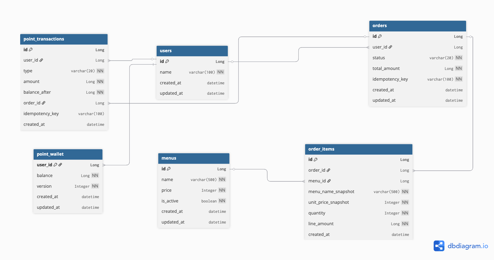

# 🚀 K사 서버 개발하기

## ✅ 과제 개요
본 프로젝트는 K사 주문·결제 서버를 구현하는 과제로,  
주문 생성, 포인트 결제, 결제 완료 이벤트 기반 데이터 수집 및  
인기 메뉴 조회 API를 구현하는 것을 목표로 합니다.

주요 요구사항은 다음과 같습니다.
- 주문 및 결제 처리 시 멱등성 보장
- 결제 완료 내역의 실시간 데이터 전송
- 최근 7일간 판매량 기준 인기 메뉴 Top3 조회
- 확장 가능한 이벤트 기반 아키텍처 설계

## 🧱 시스템 아키텍처 개요
- **Spring Boot** 기반 서버
- **Kafka**: 결제 완료 이벤트 실시간 전송
- **Redis**: 인기 메뉴 집계(ZSET)
- **MySQL**: 주문/결제 데이터 영속화

## 🛠 사용 기술 스택 및 선택 이유

### Backend
- **Java 21**
    - LTS(Long Term Support) 버전으로 안정성과 최신 언어 기능을 동시에 고려
    - `record`, 개선된 switch, 성능 개선 등으로 코드 가독성과 유지보수성 향상

- **Spring Boot 3.x**
    - Spring Framework 6 기반으로 Java 21과의 호환성 확보
    - Auto Configuration을 통해 빠른 개발 환경 구성
    - 트랜잭션 관리 및 이벤트 처리에 적합

- **Spring Data JPA (Hibernate)**
    - 주문, 결제, 포인트 등 핵심 도메인의 영속성 관리
    - 객체 중심의 도메인 모델 설계에 적합
    - 트랜잭션 경계 명확화

### Database
- **MySQL 8.0**
    - 관계형 데이터 모델이 명확한 주문/결제 도메인에 적합
    - 트랜잭션 안정성과 데이터 정합성 확보

- **Redis**
    - 인기 메뉴 집계와 같이 빠른 조회/집계가 필요한 영역에 활용
    - Sorted Set(ZSET)을 활용하여 판매량 기반 Top-N 조회를 효율적으로 처리

### Messaging
- **Apache Kafka**
    - 결제 완료 이벤트를 실시간으로 외부 데이터 수집 플랫폼에 전송
    - 주문/결제 처리와 집계 로직을 분리하여 느슨한 결합 구조 구성
    - 토픽 파티션 기반 병렬 처리로 확장성 고려

### Infra / DevOps
- **Docker / Docker Compose**
    - 로컬 환경에서 Kafka, Redis, MySQL 등 인프라 일관성 확보
    - 실행 환경 재현 가능성 향상

## ERD 설계


## 📄 API 명세서
### 👉 [API 명세서 (Notion)](https://www.notion.so/K-2e62ae9dd25b80199a24cf34335e1892?source=copy_link)

## 🧠 설계 의도 및 핵심 해결 전략

본 프로젝트에서는 주문·결제 도메인의 특성상  
**멱등성(Idempotency)** 과 **동시성(Concurrency)** 문제가 가장 중요한 설계 포인트라고 판단했습니다.  
단순히 기능을 구현하는 것을 넘어, 실제 운영 환경에서 발생할 수 있는 오류 상황을 기준으로 설계를 진행했습니다.

---

### 1️⃣ 멱등성(Idempotency) 보장 전략

주문 생성 및 포인트 차감은 **중복 요청이 금전적인 오류로 직결될 수 있는 영역**이기 때문에  
단순 재시도 허용이 아닌, 명시적인 멱등성 보장이 필요하다고 판단했습니다.

#### 고려했던 문제 상황
- 네트워크 오류로 인한 클라이언트 재시도
- 동일 요청이 동시에 여러 번 도착하는 경우
- 주문은 1건인데 포인트가 여러 번 차감되는 상황

#### 해결 전략
- 주문 및 포인트 처리에 **멱등성 키(Idempotency Key)** 도입
- 동일 멱등성 키로 이미 처리된 요청이 존재할 경우:
    - 신규 로직을 수행하지 않고
    - 기존 처리 결과를 그대로 반환

이를 통해 **같은 요청은 언제, 몇 번 요청되더라도 동일한 결과를 반환**하도록 보장했습니다.

> ⚠️ 프론트엔드 미구현 환경에 대한 멱등성 키 처리 전략

본 과제에서는 프론트엔드가 구현되지 않은 상태이기 때문에  
클라이언트가 최초 요청 시 멱등성 키를 생성하여 전달하기 어려운 환경을 고려했습니다.

이에 따라 다음과 같은 전략을 적용했습니다.

- 최초 주문 요청 시 멱등성 키가 전달되지 않은 경우  
  → **서버에서 멱등성 키를 자동 생성**
- 생성된 멱등성 키는 응답으로 반환
- 클라이언트는 이후 재시도 요청 시  
  **반환받은 멱등성 키를 그대로 사용하도록 설계**

이를 통해:
- 프론트엔드가 없는 환경에서도 멱등성 보장 가능
- 실제 서비스 환경에서는  
  클라이언트가 멱등성 키를 직접 관리하도록 확장 가능한 구조 유지

즉, **과제 환경의 제약을 고려하면서도 실서비스 확장을 염두에 둔 설계**를 목표로 했습니다.

---

### 2️⃣ 동시성 문제와 주문 처리 안정성

동시에 여러 주문 요청이 들어오는 환경에서  
애플리케이션 레벨 검증만으로는 동시성 문제를 완전히 방어하기 어렵다고 판단했습니다.

#### 고려했던 동시성 이슈
- 동일 사용자의 주문 요청이 동시에 발생하는 경우
- 주문 저장과 포인트 차감 사이의 타이밍 문제
- 일부 요청 성공, 일부 요청 실패로 인한 상태 불일치

#### 해결 전략
- **DB 레벨 유니크 인덱스(userId + idempotencyKey)** 를 통해 중복 주문을 1차 차단
- 주문 저장 이후 포인트 차감은 **PointService로 위임**
- 포인트 차감 로직 내부에서도 멱등성 검증을 한 번 더 수행

이를 통해:
- 주문 서비스는 **주문 상태 관리**에 집중
- 포인트 서비스는 **금전 처리 정합성**에 집중하는 구조로 책임을 분리했습니다.

---

### 3️⃣ 트랜잭션 경계와 이벤트 기반 분리

결제 완료 이후 수행되는 인기 메뉴 집계는  
주문/결제 트랜잭션과 **강하게 묶지 않기로 의도적으로 분리**했습니다.

#### 고민했던 선택지
- 주문 트랜잭션 내부에서 바로 집계 처리
- 결제 완료 후 이벤트 기반으로 집계 처리

#### 선택 이유
- 집계 로직 실패가 주문/결제 실패로 이어지면 안 된다고 판단
- 집계 처리 지연이 주문 응답 속도에 영향을 주지 않도록 분리 필요

#### 해결 전략
- 결제 완료 시 Kafka 이벤트 발행
- 인기 메뉴 집계는 Kafka Consumer에서 비동기 처리

이를 통해:
- 주문/결제 트랜잭션의 일관성 유지
- 집계 시스템 장애가 핵심 도메인에 영향을 주지 않는 구조 확보

---

### 4️⃣ Kafka Consumer 동시성 및 중복 처리 고려

Kafka는 **At-least-once 전달 특성**을 가지므로  
동일 메시지가 재처리될 수 있음을 전제로 설계했습니다.

#### 고려 사항
- Consumer 재시작
- 파티션 리밸런싱
- 동일 이벤트 재소비 가능성

#### 해결 전략
- Kafka 토픽을 다중 파티션으로 구성
- Consumer concurrency 설정을 통해 병렬 처리
- Redis 집계 시 중복 처리에 안전한 구조로 누적

---

### 5️⃣ Redis 기반 집계 구조 선택 이유

인기 메뉴 조회는 다음과 같은 특성을 가진다고 판단했습니다.

- 쓰기 빈도 높음
- 읽기 빈도 매우 높음
- 실시간성 요구

이에 따라:
- MySQL 집계 쿼리 대신
- Redis Sorted Set(ZSET)을 활용하여
    - 메뉴별 판매량을 score로 관리
    - Top3 조회를 효율적으로 처리

---

### ✨ 설계 요약
- 멱등성 키 기반 중복 요청 방지
- DB + 서비스 레벨 이중 방어로 동시성 대응
- 주문/결제와 집계 로직의 명확한 책임 분리
- 이벤트 기반 비동기 처리로 확장성 확보
- 실시간 조회에 적합한 Redis 집계 구조 적용

## 시작하기

### ⚓️ Docker Container 실행 
```bash
docker-compose up -d
```

### 🧪 테스트 코드 실행
```bash
./gradlew test